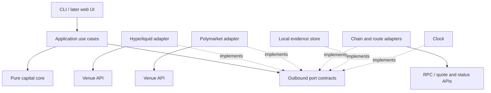

# Capital core and real-data boundaries

Design decision, 2026-09-14. This is the target implementation contract. Phase 1 now implements the observation core, account/clock/evidence ports and real readers; planning, reconciliation and monitoring sections below remain future work. The [delivery plan](roadmap.md) governs detailed sequencing and gates, including own-wallet testing and tuning before selling. The existing `src/engine.rs` remains a deterministic synthetic demo coupled to its fixture. It must not be made "live" by substituting API values for its arbitrary rules.

## One vertical slice

The product request is `FundAccount`: destination account and asset, required amount, deadline, protected source balances, and selected stress assumptions. The application observes connected accounts, reconciles evidence, evaluates a supported set of routes, and keeps the resulting decision current. See [the product decision](product.md).

The implemented workspace contains `crates/capital-core` and the root `hyprsonic` package (application, CLI and adapters under `src/observe/`). The core compiles and tests without HTTP, WebSocket, chain SDKs, a database, wall-clock reads or venue credentials. Network concurrency lives in the application, with up to four account workers. Split adapter crates only when dependency or testing needs justify them. See [implemented coverage](observations.md#coverage) for the distinction between current readers and future ports/models.

The application depends on domain types and port contracts. Adapter implementations depend inward on those contracts. The composition root chooses implementations. The diagram's external arrows represent I/O; the core has none.

## Domain objects

| Object | Required meaning |
|---|---|
| `AccountId` | Venue/network, actual account or holding-wallet identity, account mode and control scope |
| `CollateralDomainId` | The pool in which the venue actually recognizes collateral; may span several markets or DEXs |
| `AssetId` / `Quantity` | Network plus token contract or venue asset ID; checked base units and scale; no implicit dollar interchangeability |
| `CapitalClaim` | An identified economic holding, its location and status, ownership evidence, and obligations against it |
| `Observation<T>` | Value plus source reference, receive time, source time/block when available, completeness, and rule/adapter version |
| `Constraint` | Actual venue requirement, user policy or scenario assumption, clearly distinguished |
| `RouteQuote` | Input/output assets, size, estimated costs, provider reference, capture time, expiry if provided, prerequisites and timing uncertainty |
| `PlanStep` | Dependencies, resources used, possible outcomes, observed completion evidence and consequences of partial completion |
| `Decision` | Status, supported scope, horizon, assumptions, blockers, plans and their evidence references |

Use checked integer base units with explicit asset precision, plus a checked decimal representation where venue prices require it. USD reporting is a separate valuation projection. A price mark, collateral valuation and liquidation estimate are different data. Preserve source decimal strings until validated; never round money through binary floats.

The six capital views remain overlapping projections over unique claims. They are not six additive buckets. An unrealized gain may count toward a particular venue's margin under its rules without being withdrawable. An outcome position is not guaranteed future cash. Redemption eligibility, redemption submission, collateral receipt, transfer and destination credit are separate transitions.

Observation quality is independent of capital state: known, stale, missing, conflicting, incomplete or unsupported. A public wallet does not reveal every private pledge or permission. Scope any result to connected accounts and known/user-declared obligations; do not claim full balance-sheet truth. A user-declared commitment remains labeled as such.

## Ports

Inbound use cases: `ObserveAccounts`, `RequestFundingPlan`, `WatchPlan`, and `ExplainDecision`. They accept explicit IDs and user policy, not venue JSON.

| Outbound port | Contract | First adapter |
|---|---|---|
| `AccountSource` | Read account mode, holdings, commitments and coverage with source evidence; pagination/truncation explicit | Hyperliquid Info; Polymarket public account data plus permitted account reads |
| `MarketSource` | Supply instrument metadata, mark inputs and executable-price estimates with age and depth coverage | Venue REST first, streams where needed |
| `RouteSource` | Obtain supported routes and estimates for exact accounts/assets/amounts; unsupported is a normal result | Documented bridge quote/status integration, only after route verification |
| `ReceiptSource` | Observe source and destination events, confirmations and reorg/reconciliation changes | Chain RPC and venue ledger events |
| `EvidenceStore` | Append observation/decision evidence, return references, load replay inputs | Local persistent store; no production account captures in Git |
| `Clock` | Supply observation time and monotonic timers to the application | System clock in production, controlled clock in tests |

Venue rule evaluators implement a pure core `ConstraintModel` contract over normalized state and a versioned rule set. Adapter parsing does not get to silently decide that a plan is funded. Unknown account modes or missing model coverage prevent a feasibility claim.

Do not create a universal `Exchange::get_balance()` or a generic `execute()` abstraction. There is no live execution or signing port in this phase. A read endpoint that requires a broadly capable key must not be advertised as a read-only permission; onboarding must identify the actual credential powers before an authenticated adapter is enabled. Public observation cannot establish account control.

## First adapter coverage

### Hyperliquid

Resolve the actual user/subaccount, discover its account mode, then request the corresponding account state, positions, orders, metadata/marks and account ledger evidence. A read of an agent wallet can return the wrong account. Current modes have materially different collateral treatment; no per-DEX summing shortcut is allowed. [Info API](https://hyperliquid.gitbook.io/hyperliquid-docs/for-developers/api/info-endpoint), [account modes](https://hyperliquid.gitbook.io/hyperliquid-docs/trading/account-abstraction-modes), [perpetuals API](https://hyperliquid.gitbook.io/hyperliquid-docs/for-developers/api/info-endpoint/perpetuals).

Support one explicitly identified mode for funding decisions first, selected from the first configured account. Other modes can be observed with an unsupported-planning result. It is a defect if an unsupported account mode silently falls back to Phase 0's margin formula. Include initial/maintenance distinctions and source account constraints when later adding trade sizing or reductions.

### Polymarket predictions

Use the documented user positions endpoint and market lifecycle evidence, then actual collateral/holding-wallet reads and accessible commitments. Fully paginate with the lowest supported size threshold and appropriate archived-position coverage. Surface bounds or schema gaps. `currentValue`, `cashPnl` and `redeemable` do not establish an available cash balance. [Positions API](https://docs.polymarket.com/api-reference/core/get-current-positions-for-a-user), [resolution](https://docs.polymarket.com/concepts/resolution), [wallet identities and authentication](https://docs.polymarket.com/trading/wallets-auth).

Keep pUSD, USDC.e and other USDC representations distinct by contract and chain. Verify deployed contracts and actual behavior for the selected account; documentation is discovery evidence, not a receipt. If balance, commitment or redemption coverage is missing, the adapter reports the gap and the planner excludes unsupported capacity. [Collateral documentation](https://docs.polymarket.com/concepts/pusd).

### Wallet and transfer routes

Read balances and receipts for the explicit source/destination chains and contracts. Account for gas and confirmed receipts under the selected finality policy. A route from Polymarket collateral to a wallet, followed by credit into Hyperliquid, has multiple dependencies. Availability of each required asset/chain pair and the destination deposit mechanism must be verified before offering that route.

Polymarket's quote API documents estimated output and costs. Its status API refers to a bridge address and distinguishes processing, completion and failure. Keep provider estimates separate from independently observed destination credit. The documented checkout estimate is not a guaranteed upper bound or an empirical p95. [Quote API](https://docs.polymarket.com/trading/bridge/quote), [status API](https://docs.polymarket.com/trading/bridge/status).

No real route between the proposed accounts has been exercised in this design phase. No endpoint request should create a deposit/withdrawal arrangement or submit a transaction as a side effect of observation.

## Feasibility and reconciliation

Return a useful partial result, but keep these statuses distinct:

- `FEASIBLE_UNDER_ASSUMPTIONS`: supported rules and complete-enough fresh evidence satisfy the request at every modeled step, with assumptions shown.
- `CONDITIONAL`: depends on an unconfirmed fill, redemption, transfer, human action or estimated arrival; show what must become true. Never display this as already funded.
- `INFEASIBLE`: a known constraint fails. Include amount, location, deadline, source facts and alternatives where supported.
- `UNDETERMINED`: required facts, permissions, model coverage or timing bounds are missing, stale or conflicting. Explain which observation would resolve it.

Maintain observed state separately from projected plan state. Local plan reservations prevent conflicts among our plans; they do not lock assets at a venue. External activity can invalidate them. The known obligations model prevents using the same claim twice without inventing enforceable pledges.

Store source-local sequence/block information and receive ordering. Independent feeds do not provide a globally atomic snapshot. Evaluate a snapshot with an explicit observation window and freshness policy; detect excessive skew. Deduplicate events, resynchronize after gaps, handle chain reorgs, and invalidate dependent plans after contradictions. Polling adapters must honestly label their cadence.

Reconcile snapshots against observed movements without counting both as two deposits. A lost response, failed fill, rejected withdrawal or late arrival retains prior fees, resource commitments and unresolved states. Late funds cannot erase a deadline breach. A refreshed plan is a new revision, not a rewrite of the old decision.

The ledger must retain facts, inferred classifications and hypothetical transitions as different event kinds. Every decision references the exact evidence and rule versions that produced it. Replay uses captured observations; constructed corruption/delay cases remain tests and never masquerade as live history.

## Phases and acceptance

The [full roadmap](roadmap.md) expands these architecture milestones into explicit delivery phases:

| Architecture milestone | Delivery phases | Acceptance evidence |
|---|---|---|
| Real observations and core boundary | 1: connect; 2: reconcile | Actual endpoint reads, capital evidence, supported rules and explicit data gaps |
| One complete funding request | 3: plan; 4: follow | Verified routes, scenario checks, usable workspace, live plan invalidation and receipt tracking |
| Persistent internal use | 5: own-wallet trial; 6: tune | Reconciled real funding, repeated decisions, recovery and performance evidence |
| External commercial decision | 7: gated pilot decision | Internal gates passed, owner approval and defined supported scope |

Account captures and hypothetical stresses retain separate provenance. A live feed alone is not the funding workflow, and internal success does not establish willingness to pay.

Each phase is a reviewed, tested commit pushed directly to `brohamgoham/hyprsonic` on `master`, per the owner's workflow. Account data, credentials and private research stay out of commits. Phase 0 remains available as a regression suite; no further fixture expansion is the primary deliverable.

Required new validation follows the failure risks: exact unit handling, shared collateral domains, partial pagination, missing permissions, stale/out-of-order updates, duplicate events, snapshot/event reconciliation, unsupported modes, failed transfers, and destination receipt requirements. Recorded sanitized responses can test adapters deterministically; a separate opt-in network smoke check must show what was actually reached.

Measure upstream observation age, application ingress delay, core recomputation and presentation delay separately. For the initial benchmark, declare hardware, portfolio size, scenario/route counts and event rate; report p50/p95/p99. Proposed core target: p95 below 100 ms for 10 accounts, 100 positions and 20 candidate plans, without network work inside the measurement. This has not been benchmarked. Keep loss-sensitive capital events ordered; if overloaded, invalidate coverage and resync rather than dropping them silently.
